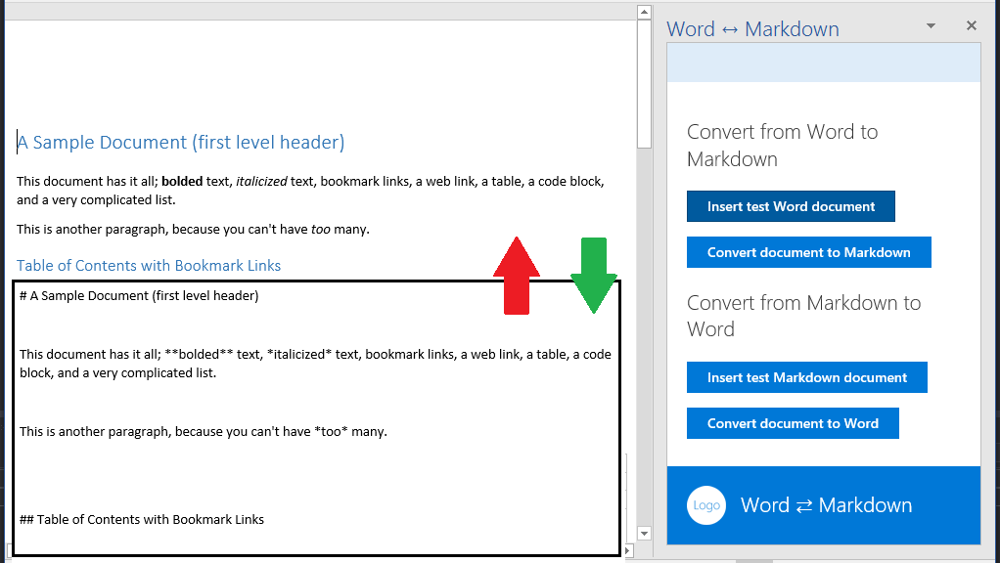

# Complemento de Office que convierte directamente del formato de Word a Markdown y viceversa

Use las API Word.js para convertir un documento Markdown a Word para la edición y, a continuación, convertir el documento de Word de nuevo al formato Markdown mediante los objetos Párrafo, Tabla, Lista e Intervalo.

## Tabla de contenido
* [Historial de cambios](#change-history)
* [Requisitos previos](#prerequisites)
* [Probar el complemento](#test-the-add-in)
* [Problemas conocidos](#known-issues)
* [Preguntas y comentarios](#questions-and-comments)
* [Recursos adicionales](#additional-resources)

## Historial de cambios

16 de diciembre de 2016:

* Versión inicial.

## Requisitos previos

* Visual Studio 2015 o posterior.
* Word 2016 para Windows, compilación 16.0.6727.1000 o posterior.

## Probar el complemento

1. Clone o descargue el proyecto en el escritorio.
2. Abra el archivo Word-Add-in-JavaScript-MDConversion.sln en Visual Studio.
2. Pulse F5.
3. Cuando se inicie Word, pulse el botón **Abrir convertidor** en la cinta de opciones **Inicio**.
4. Cuando se haya cargado la aplicación, pulse el botón **Insertar documento Markdown de prueba**.
5. Cuando se haya cargado el texto Markdown de ejemplo, pulse el botón **Convertir texto MD a Word**.
6. Después de convertir el documento a Word, edítelo. 
7. Pulse el botón **Convertir documento a Markdown**. 
8. Una vez que el documento se haya convertido, copie y pegue su contenido en un Controlador de vista previa de Markdown, como Visual Studio Code.
9. Como alternativa, puede empezar con el botón **Insertar documento de Word de prueba** y convertir a Markdown el documento de Word de ejemplo que se haya creado. 
10. Si lo desea, empiece con su propio texto de Markdown o contenido de Word y pruebe el complemento.

## Problemas conocidos

- Debido a un error en la forma en la que se generan las listas de Word creadas mediante programación, la conversión de Markdown a Word solo convertirá correctamente la primera lista (en ocasiones, las dos primeras) de un documento (todos los números de las listas Markdown se convertirán correctamente a Word).
- Si convierte el mismo documento de forma repetida de Word a Markdown y viceversa, todas las filas de la tabla adoptarán el formato de la fila de encabezado, que normalmente incluye texto en negrita.

## Preguntas y comentarios

Nos encantaría recibir sus comentarios sobre este ejemplo. Puede enviarnos comentarios a través de la sección *Problemas* de este repositorio.

Las preguntas generales sobre el desarrollo de Microsoft Office 365 deben publicarse en [Desbordamiento de pila](http://stackoverflow.com/questions/tagged/office-js+API). Si su pregunta trata sobre las API de JavaScript para Office, asegúrese de que su pregunta se etiqueta con [office-js] y [API].

## Recursos adicionales

* [Documentación de complementos de Office](https://msdn.microsoft.com/es-es/library/office/jj220060.aspx)
* [Centro de desarrollo de Office](http://dev.office.com/)
* Más ejemplos de complementos de Office en [OfficeDev en GitHub](https://github.com/officedev)

## Copyright
Copyright (c) 2016 Microsoft Corporation. Todos los derechos reservados.

