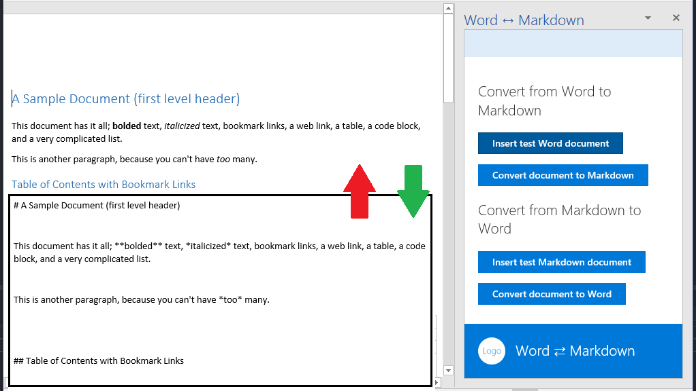

# 在 Word 與 Markdown 格式間直接轉換的 Office 增益集

使用 Word.js Api 將 Markdown 文件轉換成 Word 來進行編輯，然後再使用 Paragraph、Table、List 和 Range 物件，將 Word 文件轉換回 Markdown 格式。

## 目錄
* [變更歷程記錄](#change-history)
* [先決條件](#prerequisites)
* [測試增益集](#test-the-add-in)
* [已知問題](#known-issues)
* [問題和建議](#questions-and-comments)
* [其他資源](#additional-resources)

## 變更歷程記錄

2016 年 12 月 16 日：

* 初始版本。

## 先決條件

* Visual Studio 2015 或更新版本。
* Word 2016 for Windows，組建 16.0.6727.1000 或更新版本。

## 測試增益集

1. 將專案複製或下載到您的桌面。
2. 在 Visual Studio 中開啟 Word-Add-in-JavaScript-MDConversion.sln 檔案。
2. 按下 F5。
3. 在 Word 啟動後，按下 [常用]**** 功能區上的 [開啟轉換器]**** 按鈕。
4. 當應用程式載入時，按下按鈕 [插入測試 Markdown 文件]****。
5. 在範例 Markdown 文字載入之後，按下按鈕 [將 MD 文字轉換成 Word]****。
6. 在文件轉換成 Word 後，編輯該文件。 
7. 按下按鈕 [將文件轉換為 Markdown]****。 
8. 在文件轉換後，請將其內容複製並貼入 Markdown 預覽程式 (例如 Visual Studio Code)。
9. 或者，您可以開始使用按鈕 [插入測試 Word 文件]****，並將建立的範例 Word 文件轉換成 Markdown。 
10. 或者，開始使用您自己的 Markdown 文字或 Word 內容，並測試增益集。

## 已知問題

- 因為 programmatically-created Word 清單建立方式的問題，Markdown-to-Word 只會順利轉換文件中的第一個清單 (有時候為前兩個清單)。(所有 Markdown 清單將會順利轉換為 Word。)
- 如果您在 Word 和 Markdown 之間來回重複轉換相同文件時，資料表中所有資料列將會採用標題列的格式 (通常包含粗體文字)。
- 增益集會使用 Word Online 中尚未支援的某些 Office API (至 2017 年 2 月 15 日為止)。您應該在桌面的 Word 進行測試 (當您按下 F5 時會自動開啟)。

## 問題和建議

我們很樂於收到您對於此範例的意見反應。您可以在此存放庫的 [問題]** 區段中，將您的意見反應傳送給我們。

請在 [Stack Overflow](http://stackoverflow.com/questions/tagged/office-js+API) 提出有關 Microsoft Office 365 開發的一般問題。如果您的問題是關於 Office JavaScript API，請確定您的問題標記有 [office js] 與 [API]。

## 其他資源

* 
  [Office 增益集文件](https://msdn.microsoft.com/en-us/library/office/jj220060.aspx)
* [Office 開發人員中心](http://dev.office.com/)
* 在 [Github 上的 OfficeDev](https://github.com/officedev) 中有更多 Office 增益集範例

## 著作權
Copyright (c) 2016 Microsoft Corporation.著作權所有，並保留一切權利。

此專案已採用 [Microsoft 開放原始碼管理辦法](https://opensource.microsoft.com/codeofconduct/)。如需詳細資訊，請參閱[管理辦法常見問題集](https://opensource.microsoft.com/codeofconduct/faq/)，如果有其他問題或意見，請連絡 [opencode@microsoft.com](mailto:opencode@microsoft.com)。
